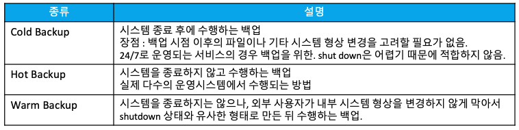
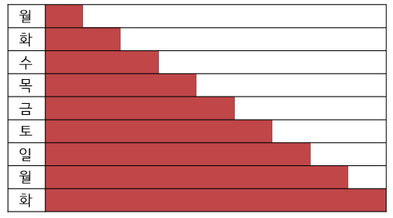
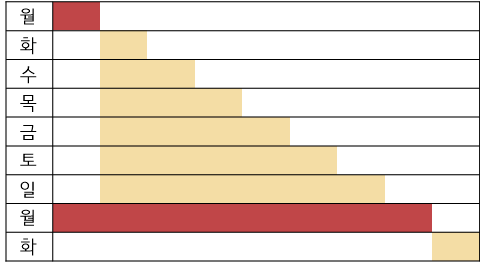
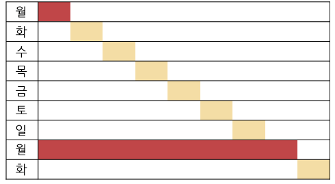
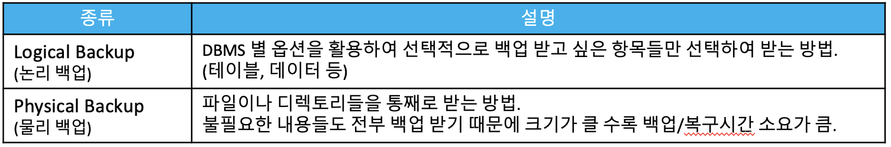
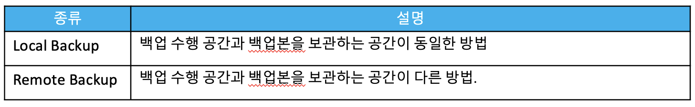

# Back up & Restore

## 백업의 필요성과 정의

**백업이 필요한 이유?**

- DB가 설치되어있던 서버가 죽었는데 복구가 안된다면?
- DDL, DML문을 잘못 작성을 해서 변경 대상이 아니었던 정보를 업데이트 하거나 삭제를 했다면?


DB의 변경 이전 상태를 보관해놓은 형태를 백업이라 합니다.


## 백업의 종류

- 시스템 종료 여부에 따른 종류




- 백업 범위에 따른 종류
  - **Full Backup** : 데이터 변경 유무와 관계 없이 전체 데이터를 백업하는 방식. 복구가 간편하나, 백업 시간이 많이 소요됨.
  - **Differential Backup** : 마지막 전체 백업 이후의 변경된 모든 데이터를 백업하는 방식. 복구시간이 증분 백업에 비해 적게 소요됨.
  - **Incremental Backup** : 일정 시간마다 변경된 데이터만 백업하는 방식. 복구 시간은 타 방식에 비해 오래걸리지만, 백업이 빠름.


- 백업 방식에 따른 종류




- 백업본 보관 공간에 따른 종류




## PostgreSQL이 지원하는 백업 방법

### SQL Dump

- 백업을 하고자 하는 당시의 상태를 기준으로 데이터베이스를 다시 만드는 덤프 파일을 생성하는 방법
- Warm Backup & Full backup & Logical Backup
- PostgreSQL에서 제공하는 pg_dump 커맨드를 활용하여 덤프 파일을 생성할 수 있습니다.
- pg_dump는 슈퍼유저여야만 실행이 가능합니다.

```bash
pg_dump -h host -p port -U superuser dbinstance > dumpfile # sql script 형태로 백업
pg_dump -h host -p port -U superuser -Ft dbinstance > dumpfile # tar 형태로 백업
pg_dump -h host -p port -U superuser -Fd dbinstance > dumpfile # dir 형태로 백업
```

- DB 인스턴스별 덤프가 아닌 전체 덤프를 하고싶은 경우 pg_dumpall 커맨드를 활용할 수 있습니다.

```bash
pg_dumpall > dumpfile
```

- pg_dump/pg_dumpall로 만든 덤프 파일은 psql 커맨드 또는 pg_restore 커맨드를 통해 복원이 가능합니다.
  - 단, sql script 형태로 만들어진 덤프 파일은 psql 커맨드로만 복원 가능하고, 그 외 형태의 경우 pg_restore 커맨드로만 복원 가능합니다.

```bash
psql -h host -p port -U superuser dbinstance < dumpfile # pg_dump 로 만든 sql script 파일 기준 예시
psql -h host -p port -U superuser -f dumpfile # pg_dumpall 로 만든 sql script 파일 기준 예시
pg_restore -h host -U superuser 
```

- psql/pg_restorel과 pg_dump 커맨드를 조합하여 백업 파일을 다른 서버의 DB로 이전 가능합니다.

```bash
pg_dump -h host1 -U host1user host1dbname | psql -h host2 -U host2user host2dbname
pg_dump -h host1 -U host1user -Ft host1dbname | pg_restore -h host2 -U host2user -d host2dbname
```


#### [심화] 대용량 DB 백업 & 병렬 덤프

DB 내 데이터 사이즈가 클 경우 gzip 을 이용해 압축을 하며 백업을 할 수 있습니다.

```bash
pg_dump dbname | gzip > dumpfile.gz # 백업
gunzip -c dumpfile.gz | psql dbname # 복원
```

또는 적당한 크기로 chunk 사이즈를 정해서 분할 백업을 할 수 있습니다.

```bash
pg_dump dbname | split -b 2G - dumpfile # 2G 단위 chunk 사이즈로 분할하는 예시
cat dumpfile* | psql dbname # 복원
```

백업 속도를 높이기 위해 병렬 pg_dump 커맨드의 병렬 모드를 활용할 수 있습니다. -j 파라미터를 활용하여 병렬 정도를 제어할 수 있습니다.

병렬모드는 dir 형태의 백업 덤프 형식만  지원합니다.

```bash
pg_dump -j 2 -Fd -f dumpdir dbname # 병렬정도를 2로 설정하여 백업 덤프 처리
```

복구도 병렬 모드가 지원됩니다. 복구의 경우 어떤 아카이브형태라도 지원이 가능하며, pg_dump -j  옵션을 통해서 만들어진 게 아니라도 가능합니다.

```bash
pg_restore -j 2 -d dbname dumpfile
```


**pg_dump, pg_dumpall, pg_restore 의 상세 옵션들은 아래 공식 문서 참조 바랍니다.**

- https://www.postgresql.org/docs/14/app-pgdump.html
- https://www.postgresql.org/docs/14/app-pg-dumpall.html
- https://www.postgresql.org/docs/14/app-pgrestore.html


#### [실습] SQL Dump 백업 실습

backupscript, backuptar 라는 DB 인스턴스를 생성하고, dvdrental의 데이터/스키마를 dump 해봅니다. 

sql script 방식, tar 방식 두가지를 모두 실행해보고, 복원도 두가지 방식을 모두 수행해봅니다.


1. DB 인스턴스 생성

```bash
psql -h localhost -U dvdadmin dvdrental
postgres=# create database backupscript;
postgres=# create database backuptar;
postgres=# grant all on database backupscript to dvdadmin;
postgres=# grant all on database backuptar to dvdadmin;
postgres=# \q
```

2. dvdrental 백업

```bash
pg_dump -h localhost -U dvdadmin dvdrental > dvdscriptdump
pg_dump -h localhost -U dvdadmin -Ft dvdrental > dvdtardump.tar
```

3. dvdscriptdump 복구

```bash
psql -h localhost -U dvdadmin backupscript < dvdscriptdump
```

4. dvdtardump.tar 복구

```bash
pg_restore -h localhost -U dvdadmin -d backuptar dvdtardump.tar
```

#### [추가 실습] 병렬모드 사용해보기

1. DB 인스턴스 생성

```bash
psql -h localhost -U dvdadmin dvdrental
postgres=# create database paralleltest;
postgres=# grant all on database paralleltest to dvdadmin;
postgres=# \q
```

2. 병렬 백업

```bash
pg_dump -h localhost -U dvdadmin -j 4 -Fd -f rentdumpdir dvdrental
```

3. 병렬 복구

```bash
pg_restore -h localhost -U dvdadmin -j 4 -d parallel rentdumpdir
```


### file system 수준 Backup

- 실제 data와 conf 파일이 적재되어있는 폴더를 복제하는 방법
- Cold Backup & Full backup & Physical Backup
- SQL Dump 방식보다 백업되는 파일의 크기가 큽니다.
- 특정 DB 인스턴스, 특정 테이블에 대해서 백업하는 것이 불가능합니다.

```bash
systemctl stop postgresql-14
tar -cf backup.tar /var/lib/pgsql/14/data # initdb 시 별도의 data 폴더 위치를 설정하지 않았을 경우에만 위치 해당.
```


### 지속적인 아카이빙 & Point-in-Time Recovery (PITR)


