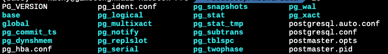
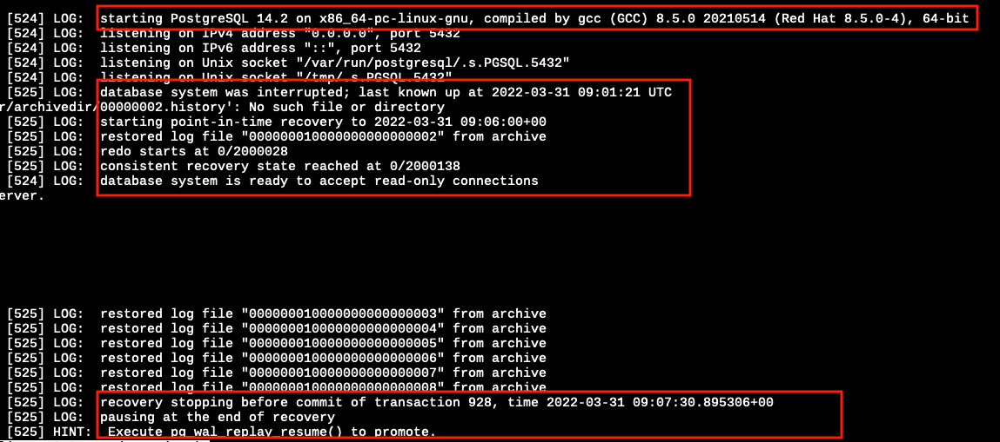

# Back up & Restore

## 백업의 필요성과 정의

**백업이 필요한 이유?**

- DB가 설치되어있던 서버가 죽었는데 복구가 안된다면?
- DDL, DML문을 잘못 작성을 해서 변경 대상이 아니었던 정보를 업데이트 하거나 삭제를 했다면?
- 누군가 악의적으로 접근해서 테이블을 다 날려버렸다면?


DB의 변경 이전 상태를 보관해놓은 형태를 백업이라 합니다.


## 백업의 종류

- 시스템 종료 여부에 따른 종류


- 백업 범위에 따른 종류
  - **Full Backup** : 데이터 변경 유무와 관계 없이 전체 데이터를 백업하는 방식. 복구가 간편하나, 백업 시간이 많이 소요됨.
  - **Differential Backup** : 마지막 전체 백업 이후의 변경된 모든 데이터를 백업하는 방식. 복구시간이 증분 백업에 비해 적게 소요됨.
  - **Incremental Backup** : 일정 시간마다 변경된 데이터만 백업하는 방식. 복구 시간은 타 방식에 비해 오래걸리지만, 백업이 빠름.


- 백업 방식에 따른 종류


- 백업본 보관 공간에 따른 종류


## PostgreSQL이 지원하는 백업 방법

### SQL Dump

- 백업을 하고자 하는 당시의 상태를 기준으로 데이터베이스를 다시 만드는 덤프 파일을 생성하는 방법
- Warm Backup(?) & Full backup & Logical Backup
- PostgreSQL에서 제공하는 pg_dump 커맨드를 활용하여 덤프 파일을 생성할 수 있습니다.
- pg_dump는 슈퍼유저여야만 실행이 가능합니다.

```bash
pg_dump -h host -p port -U superuser dbinstance > dumpfile # sql script 형태로 백업
pg_dump -h host -p port -U superuser -Ft dbinstance > dumpfile # tar 형태로 백업
pg_dump -h host -p port -U superuser -Fd dbinstance > dumpfile # dir 형태로 백업
```

- DB 인스턴스별 덤프가 아닌 전체 덤프를 하고싶은 경우 pg_dumpall 커맨드를 활용할 수 있습니다.

```bash
pg_dumpall > dumpfile
```

- pg_dump/pg_dumpall로 만든 덤프 파일은 psql 커맨드 또는 pg_restore 커맨드를 통해 복원이 가능합니다.
  - 단, sql script 형태로 만들어진 덤프 파일은 psql 커맨드로만 복원 가능하고, 그 외 형태의 경우 pg_restore 커맨드로만 복원 가능합니다.

```bash
psql -h host -p port -U superuser dbinstance < dumpfile # pg_dump 로 만든 sql script 파일 기준 예시
psql -h host -p port -U superuser -f dumpfile # pg_dumpall 로 만든 sql script 파일 기준 예시
pg_restore -h host -U superuser 
```

- psql/pg_restorel과 pg_dump 커맨드를 조합하여 백업 파일을 다른 서버의 DB로 이전 가능합니다.

```bash
pg_dump -h host1 -U host1user host1dbname | psql -h host2 -U host2user host2dbname
pg_dump -h host1 -U host1user -Ft host1dbname | pg_restore -h host2 -U host2user -d host2dbname
```


#### [심화] 대용량 DB 백업 & 병렬 덤프

DB 내 데이터 사이즈가 클 경우 gzip 을 이용해 압축을 하며 백업을 할 수 있습니다.

```bash
pg_dump dbname | gzip > dumpfile.gz # 백업
gunzip -c dumpfile.gz | psql dbname # 복원
```

또는 적당한 크기로 chunk 사이즈를 정해서 분할 백업을 할 수 있습니다.

```bash
pg_dump dbname | split -b 2G - dumpfile # 2G 단위 chunk 사이즈로 분할하는 예시
cat dumpfile* | psql dbname # 복원
```

백업 속도를 높이기 위해 병렬 pg_dump 커맨드의 병렬 모드를 활용할 수 있습니다. -j 파라미터를 활용하여 병렬 정도를 제어할 수 있습니다.

병렬모드는 dir 형태의 백업 덤프 형식만  지원합니다.

```bash
pg_dump -j 2 -Fd -f dumpdir dbname # 병렬정도를 2로 설정하여 백업 덤프 처리
```

복구도 병렬 모드가 지원됩니다. 복구의 경우 어떤 아카이브형태라도 지원이 가능하며, pg_dump -j  옵션을 통해서 만들어진 게 아니라도 가능합니다.

```bash
pg_restore -j 2 -d dbname dumpfile
```


**pg_dump, pg_dumpall, pg_restore 의 상세 옵션들은 아래 공식 문서 참조 바랍니다.**

- https://www.postgresql.org/docs/14/app-pgdump.html
- https://www.postgresql.org/docs/14/app-pg-dumpall.html
- https://www.postgresql.org/docs/14/app-pgrestore.html


#### [실습] SQL Dump 백업 실습

backupscript, backuptar 라는 DB 인스턴스를 생성하고, dvdrental의 데이터/스키마를 dump 해봅니다. 

sql script 방식, tar 방식 두가지를 모두 실행해보고, 복원도 두가지 방식을 모두 수행해봅니다.


1. DB 인스턴스 생성

```bash
psql -h localhost -U dvdadmin dvdrental
postgres=# create database backupscript;
postgres=# create database backuptar;
postgres=# grant all on database backupscript to dvdadmin;
postgres=# grant all on database backuptar to dvdadmin;
postgres=# \q
```

2. dvdrental 백업

```bash
pg_dump -h localhost -U dvdadmin dvdrental > dvdscriptdump
pg_dump -h localhost -U dvdadmin -Ft dvdrental > dvdtardump.tar
```

3. dvdscriptdump 복구

```bash
psql -h localhost -U dvdadmin backupscript < dvdscriptdump
```

4. dvdtardump.tar 복구

```bash
pg_restore -h localhost -U dvdadmin -d backuptar dvdtardump.tar
```

#### [추가 실습] 병렬모드 사용해보기

1. DB 인스턴스 생성

```bash
psql -h localhost -U dvdadmin dvdrental
postgres=# create database paralleltest;
postgres=# grant all on database paralleltest to dvdadmin;
postgres=# \q
```

2. 병렬 백업

```bash
pg_dump -h localhost -U dvdadmin -j 4 -Fd -f rentdumpdir dvdrental
```

3. 병렬 복구

```bash
pg_restore -h localhost -U dvdadmin -j 4 -d parallel rentdumpdir
```


### file system 수준 Backup

- 실제 data와 conf 파일이 적재되어있는 폴더를 복제하는 방법
- Cold Backup & Full backup & Physical Backup
- SQL Dump 방식보다 백업되는 파일의 크기가 큽니다.
- 특정 DB 인스턴스, 특정 테이블에 대해서 백업하는 것이 불가능합니다.

```bash
systemctl stop postgresql-14
tar -cf backup.tar /var/lib/pgsql/14/data # initdb 시 별도의 data 폴더 위치를 설정하지 않았을 경우에만 위치 해당.
```


### 지속적인 아카이빙 & Point-in-Time Recovery (PITR)

**WAL (Write Ahead Logging) 이란**

- DB에 가해지는 수정을 적용하기 전에 로그에 기록하는 것.
- ACID 특성 중 원자성과 내구성을 보장하는 기술의 한 계열
- redo, undo 정보가 둘 다 로그에 저장됨
- 시스템이 다운되었다가 다시 복구되었을 때 WAL 로그 기반으로 현재까지의 작업과 해야할 작업을 분석하여 해야할 작업만 재진행.


**WAL 기반 지속적 아카이빙**

- PostgreSQL은 WAL을 활용하여 백업을 할 수 있게 지원함
- Hot Backup & Incremental Backup & Physical Backup
- WAL을 활용하기 위해서는 특정 시점의 file system 수준의 dump가 필요함. 
  - pg_basebackup
  - pg_start_backup && pg_stop_backup
  - file system backup

- file system backup과 마찬가지로 전체 데이터베이스 클러스터 복원만 지원 가능
- 많은 아카이브 스토리지가 필요함
- 각 WAL 세그먼트 파일은 기본 16MB (initdb시 세그먼트 크기 변경 가능) 
- WAL 세그먼트 파일은 rolling 형태로 재활용 되므로, WAL 기반 아카이빙 활용 시 다 채워진 WAL 파일 내용을 캡처하고 어딘가에 저장해야 함.
  - 저장 방식, 위치 등은 상관없으나, archive_command 옵션을 통해 저장 커맨드 작성이 필요함


**WAL 기반 아카이빙을 위한 지정 필수 옵션 (postgresql.conf)**

```properties
wal_level = replica # 옵션이 replica 이상이어야 함. minimal, replica, logical
archive_mode = on # off, on, always
archive_command = 'test ! -f /mnt/server/archivedir/%f && cp %p /mnt/server/archivedir/%f' # 리눅스 예시 커맨드
archive_timeout = 60 #아카이빙 파일 교체 주기 설정 1 = 1s. 보통 60초로 설정하는 것이 안정적임.
```


**pg_basebackup을 활용한 기본 백업** 

pg_basebackup 은 pg_start_backup의 low level API에서 진행해야하는 절차를 하나의 커맨드로 실행되도록 하는 장점이 있습니다.

아래 커맨드는 pg_basebackup의 예시이며, 사용된 옵션은 아래와 같습니다.

- /backup/data 폴더에 백업본을 생성하겠다 (-D /backup/data)
- tar 파일로 생성하겠다 (-Ft)
- 생성된 tar 파일을 gzip으로 압축하겠다(-z)
- 백업 진행률 보고를 하겠다.(-P)

```bash
pg_basebackup -D /backup/data -Ft -z -P
```

더 많은 옵션은 https://www.postgresql.org/docs/14/app-pgbasebackup.html 를 참고하시기 바랍니다.


**pg_start_backup을 활용한 백업**

pg_start_backup은 pg_basebackup과 달리 절차가 여러가지가 있으나, 옵션을 사정에 맞게 조정이 가능하다는 장점이 있습니다.

1. 슈퍼유저 속성의 role 또는 함수 execute 권한을 가진 role로 postgreSQL 서버 연결
2. 아래 LABEL에 백업 작업 식별용 문자열을 작성하여 쿼리 실행 후 쿼리 실행이 완료될 때까지 연결 유지
   1. 각 파라미터별 설명 
      1. 첫번째 파라미터 : 백업 작업 식별용 문자열
      2. 백업 수행을 위해 I/O를 최대한 많이 쓸건지에 대한 여부
      3. 이 백업이 수행되는 동안 다른 백업이 수행되지 못하게 할건지 (배타성)

```sql
SELECT pg_start_backup('LABEL', false, false);
```

3. 데이터 디렉토리 기반 백업 방식으로 data 디렉토리 백업. 이때 database를 중단시킬 필요 없음.
4. 아래 쿼리를 실행합니다.

```sql
SELECT * FROM pg_stop_backup(false, true);
```

pg_stop_backup은 현재 활성화된 WAL 세그먼트까지 아카이브가 되고나면 종료처리되며, 마지막 WAL 세그먼트 이름을 리턴합니다.


**데이터 디렉토리 기반 백업**

data 디렉토리를 tar 아카이브 또는 디렉토리 복사 등을 통해서 통으로 백업하는 방식입니다. 단독으로 행하는 데이터 디렉토리 백업과  pg_start_backup과의 차이점은 아래와 같습니다.

1. pg_start_backup/pg_stop_backup을 활용하지 않기 때문에 백업 파일 식별이 어렵습니다.
2. pg_start_backup/pg_stop_backup을 활용하지 않기 때문에 어느 WAL 파일까지 백업을 처리한 것인지는 확인할 수 없습니다.


데이터 디렉토리 구조를 살펴보면 아래 그림과 같습니다.



data 디렉토리를 tar 파일 등으로 아카이브할 때 아래 파일들은 가급적 제외하고 진행합니다.

- pg_wal 하위 파일 (필수)
- postmaster.opts, postmaster.pid 파일 (필수)
- pg_replslot 하위 파일 - 복제 슬롯을 백업하지 않기 위함 (선택)
- pg_dynshmem, pg_notify, pg_serial, pg_snapshots, pg_stat_tmpd, pg_subtrans 하위 파일 - 어차피 postgreSQL 재시작시 초기화됨. (선택)
- pgsql_tmp* 형태의 디렉토리 (선택)


#### WAL 기반 복구

1. postgreSQL 서버를 중지 시킵니다.

2. 디스크 공간이 여유가 된다면 나중을 대비해 데이터 디렉토리와 테이블 스페이스를 임시 위치에 복제해둡니다. pg_wal 하위에 아카이브가 되지 않은 WAL 파일이 있다면 그것도 복제합니다.

   1. 테이블 스페이스 : 물리적으로 분리된 경로를 DB에 추가 사용하는 것. (예시 참조)

   ```sql
   CREATE TABLESPACE fastspace LOCATION '/ssd/mydb2/data';
   CREATE TABLE emp(empno int, name varchr(12)) TABLESPACE fastspace;
   ```

3. 데이터 디렉토리, 테이블 스페이스 디렉토리 하위 모든 파일과 디렉토리를 제거합니다.

4. 파일 시스템 백업본을 기반으로 데이터베이스 파일을 복원합니다. (소유권 postgres)

   1. 테이블스페이스를 사용하는 경우 pg_tblspc 복원이 문제가 없는지 확인합니다.

5. pg_wal 내 파일을 모두 삭제하고, 아카이브가 되지 않은 WAL 파일을 다시 가져와서 붙여넣습니다.

6. postgresql.conf를 적절히 수정합니다.

   ```properties
   restore_command = 'cp /mnt/server/archivedir/%f "%p"' # 복구 커맨드 지정
   archive_cleanup_command = 'pg_archivecleanup /mnt/server/archivedir %r' # 오래된 아카이브 정리 커맨드 지정
   ```

7. recovery.signal 파일을 만듭니다.
8. 복구에 성공하기 전까지 일반 사용자가 연결할 수 없도록 pg_hba.conf 파일을 수정합니다.
9. 서버를 시작하면 복구 절차가 진행되며, 복구가 완료되면 recovery.signal 파일은 삭제됩니다.
10. 정상 복구되었는지 확인 후 pg_hba.conf를 원상복구 하여 사용자가 연결할 수 있게 합니다.


**[심화] 특정 시점으로의 복구**

복구 중지 지점을 postgresql.conf 내의 매개변수를 이용하여 설정할 수 있습니다.

- recovery_target = 'immdiate' : 일관적인 상태가 되자마자 복구가 종료되도록 함. 온라인 백업에서 복구하는 경우, 백업이 끝난 시점을 의미. 
- recovery_target_name : 복구가 진행되는 명명된 복원지점을 지정
- recovery_target_inclusive : 지정된 복구대상 직후에서 중지할 지 복구대상 직전에서 중지할지 결정.
- recovery_target_time : 복구가 진행되는 타임스탬프 지정 (정확한 복구지점은 recovery_target_inclusive의 영향을 받음)
- recovery_target_xid : 복구가 진행될 트랜잭션 ID를 지정 (정확한 복구지점은 recovery_target_inclusive의 영향을 받음)
- recovery_target_lsn : 복구가 진행되는 WAL 위치의 LSN을 지정 (정확한 복구지점은 recovery_target_inclusive의 영향을 받음)
- recovery_target_timeline : 특정 타임라인으로 복구. (current, latest 또는 타임라인 ID)
  - current : 기본백업 수행지점으로 복구
  - latest : 아카이브에서 찾은 최신 타임라인으로 복구
- recovery_target_action : 복구 대상에 도달한 후 서버가 취해야하는 조치를 지정
  - pause(default) : 복구 일시 중지
  - promote : 복구 프로세스 완료 후 서버가 연결을 수락함
  - shutdown : 복구 대상 도달 후 서버를 중지. (recovery.signal 파일이 자동 삭제 되지 않아 수동 삭제 해줘야 함.) 

#### [실습] 지속적인 아카이빙 & PITR 실습

postgresql.conf를 아래와 같이 변경합니다.(postgres 계정)

```properties
wal_level = replica # 옵션이 replica 이상이어야 함. minimal, replica, logical
archive_mode = on # off, on, always
archive_command = 'test ! -f /mnt/server/archivedir/%f && cp %p /mnt/server/archivedir/%f' # 리눅스 예시 커맨드
archive_timeout = 10 # 아카이빙 테스트를 위해 10초로 설정
restore_command = 'cp /mnt/server/archivedir/%f "%p"' # 복구 커맨드 지정
archive_cleanup_command = 'pg_archivecleanup /mnt/server/archivedir %r' # 오래된 아카이브 정리 커맨드 지정
```

서버를 재시작합니다.

```bash
# root 계정
systemctl restart postgresql-14
```

백업 베이스 파일을 만듭니다.

```bash
# postgres 계정
pg_basebackup -D /mnt/server/archivedir/backuptar -Ft -z -P
```

아래와 같이 actor 테이블에 데이터를 넣어줍니다. 

```sql
insert into actor (first_name, last_name, last_update) values ('Yeojeong', 'Yoon', now());
insert into actor (first_name, last_name, last_update) values ('Hyesoo', 'Kim', now());
insert into actor (first_name, last_name, last_update) values ('Taeri', 'Kim', now());
insert into actor (first_name, last_name, last_update) values ('Seoyeon', 'Choi', now());
insert into actor (first_name, last_name, last_update) values ('Jeongwon', 'Choi', now());
insert into actor (first_name, last_name, last_update) values ('Sumi', 'Jeon', now());
insert into actor (first_name, last_name, last_update) values ('Jeonghee', 'Lim', now());
insert into actor (first_name, last_name, last_update) values ('Yeri', 'Han', now());
insert into actor (first_name, last_name, last_update) values ('Jihye', 'Lee', now());
insert into actor (first_name, last_name, last_update) values ('Joohyun', 'Ok', now());
insert into actor (first_name, last_name, last_update) values ('Jiyeon', 'Park', now());
insert into actor (first_name, last_name, last_update) values ('Sohee', 'Han', now());
insert into actor (first_name, last_name, last_update) values ('Mido', 'Jeon', now());
insert into actor (first_name, last_name, last_update) values ('Yejin', 'Son', now());
insert into actor (first_name, last_name, last_update) values ('JeongAh', 'Yeom', now());
insert into actor (first_name, last_name, last_update) values ('Dami', 'Kim', now());
insert into actor (first_name, last_name, last_update) values ('Hyeyoon', 'Kim', now());
insert into actor (first_name, last_name, last_update) values ('Sojin', 'Kim', now());
insert into actor (first_name, last_name, last_update) values ('Hyeok', 'Kim', now());
insert into actor (first_name, last_name, last_update) values ('Seyoung', 'Lee', now());
insert into actor (first_name, last_name, last_update) values ('Jiyeong', 'Park', now());
insert into actor (first_name, last_name, last_update) values ('Eunbin', 'Park', now());
insert into actor (first_name, last_name, last_update) values ('Chaeyeon', 'Jeong', now());
insert into actor (first_name, last_name, last_update) values ('Yoongyoung', 'Bae', now());
insert into actor (first_name, last_name, last_update) values ('Hyunjoo', 'Paik', now());
```

현재 타임스탬프를 확인하고, 기록해둡니다.

```sql
select now();
```

아래 쿼리를 돌려서 60초 이후에 모든 actor들의 성을 Kim으로 바꿔줍니다.

```sql
select pg_sleep(60)
update actor set last_name = 'Kim';
```

postgresql 서버를 다시 중지시킵니다.

```bash
# root 계정
systemctl stop postgresql-14
```

data 디렉토리를 data.bak 에 복제한 후 data 디렉토리 하위에 있는 모든 파일을 삭제합니다.

```bash
# postgres 계정
cd /var/lib/pgsql/14
cp -r data data.bak
cd data
rm -rf *
```

베이스 백업본을 가져와 data 디렉토리 아래에 아카이브를 해제합니다.

```bash
# postgres 계정
cp /mnt/server/archivedir/backuptar/base.tar.gz /var/lib/pgsql/14/data/
tar -zxvf base.tar.gz
```

data.bak/pg_wal 폴더와 wal 아카이브본이 있는 폴더(mnt/server/archivedir/) 내의 파일 리스트를 비교하여 아카이브 되지 않은 WAL 들과 archive_status 폴더를 data/pg_wal/로 복제해줍니다.

```bash
# postgres 계정
cd /var/lib/pgsql/14/data.bak/pg_wal
cp $NOT_ARCHIVED$ /var/lib/pgsql/14/data/pg_wal/
rm -rf /var/lib/pgsql/14/data/pg_wal/archive_status
cp -r archive_status /var/lib/pgsql/14/data/pg_wal/
.....
```

recovery.signal 파일을 생성합니다.

```bash
# postgres 계정
cd /var/lib/pgsql/14/data
cat > recovery.signal # 이후 ctrl + D
```

위에서 기록한 타임스탬프를 아래와 같이 postgresql.conf에 작성합니다. (예시는 2022-03-31-09:06:00 UTC로 작성)

```properties
recovery_target_time='2022-03-31 09:06:00 UTC'
```

postgreSQL을 다시 실행하고, journalctl -f 를 통해 성공적으로 복구가 되는지 확인합니다.

```sql
# root 계정
systemctl start postgresql-14
journalctl -f
```



성공적으로 복구가 된 것을 확인하면 아래 쿼리를 통해 총 actor가 225개가 맞는지, 또 last_name이 Kim으로 변경되어있던게 원상복구된건지 확인합니다.

```bash
# postgres 계정
psql -d dvdrental
dvdrental=# select count(last_name from actor;
dvdrental=# select pg_wal_replay_resume();
```

```sql
select count(last_name from actor;
```

원상복구가 확인된다면 아래와 같이 pg_wal_replay_resume() 실행을 하여 서버를 복구모드에서 운영모드로 바꾸어줍니다.

```sql
select pg_wal_replay_resume();
```

recovery.signal 파일이 자동 삭제 되었는지 확인해봅니다.

```bash
# postgres 계정
cd /var/lib/pgsql/14/data/
find recovery.signal
```


## [After Task] PostgreSQL 이중화

PostgreSQL은 WAL 파일을 기반으로 standby 서버를 구성할 수 있습니다.

RDB의 운영 안정성 확보를 위해 WAL 파일 기반 standby 서버 구성 방법에 대해 확인해보고, 다음 세션에서 간단히 의견을 나누어봅시다.